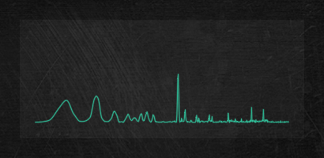

# audio-visualizer-screenlet
Visualizes sound card output (PulseAudio monitor or WASAPI loopback).

## Installation

### Anaconda/Miniconda Python

    python setup.py develop

### Debian Stretch

    sudo apt install git virtualenv python3-dev libfftw3-dev python3-numpy \
    python3-pyqt5 python3-pyqt5.qtopengl python3-scipy python3-vispy \
    python3-watchdog python3-xlib 
    git clone https://github.com/ninlith/audio-visualizer-screenlet.git
    cd audio-visualizer-screenlet
    virtualenv --python=python3 --system-site-packages venv
    source venv/bin/activate
    pip install pyfftw

### Windows (64-bit)
Use the [installer](https://github.com/ninlith/audio-visualizer-screenlet/releases/).

## Controls

Binding | Action 
------- | ------ 
Mouse Wheel | adjust sensitivity

## Usage

    usage: avs.py [-h] [-d]

    optional arguments:
      -h, --help   show this help message and exit
      -d, --debug  enable DEBUG logging level

## Configuration
`settings.ini` file inside `audio-visualizer-screenlet` folder inside `%LOCALAPPDATA%` (Windows) or `$XDG_CONFIG_HOME` or `$HOME/.config`.

If this folder does not exist, it will be created.

## License
GNU GPLv3
